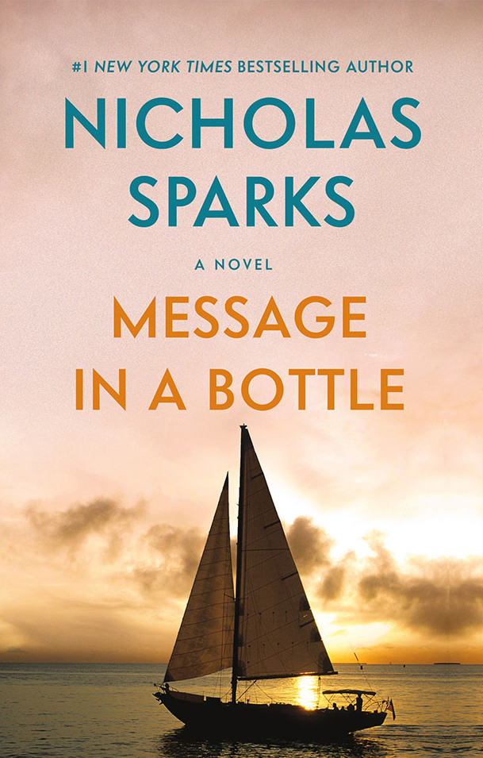

## Message in a Bottle

Thrown into the waves and left to the whims of fate, the bottle could have journeyed to any corner of the sea. Yet, fate had other plans, guiding it to shore a mere three weeks later.

Theresa Osborne, a divorced mother to a twelve-year-old son and a Boston newspaper columnist, stumbles upon the bottle during a seaside getaway. Inside, she finds a letter that begins with heartfelt words addressed to "My Dearest Catherine," expressing longing and memories of shared moments. For Garrett, the letter is a testament to his enduring love for a lost woman. For Theresa, who has grown wary of love after her husband's betrayal, the letter raises intriguing questions.

Intrigued by the mystery and compelled by emotions she can't fully comprehend, Theresa embarks on a quest to find Garrett. Her journey leads her to a sunlit coastal town and an unexpected encounter. United by chance or perhaps by a greater force, Theresa and Garrett's lives intertwine in a tale that echoes our deepest desires for lasting love.

Pulsating with suspense and emotional depth, "Message in a Bottle" invites readers on a quest for truth about a man and his memories, exploring both the heartbreaking fragility and immense strength of love. For fans of "The Notebook" and newcomers to Nicholas Sparks's storytelling, this novel offers a poignant exploration of serendipity, longing, and the choices that shape our lives.