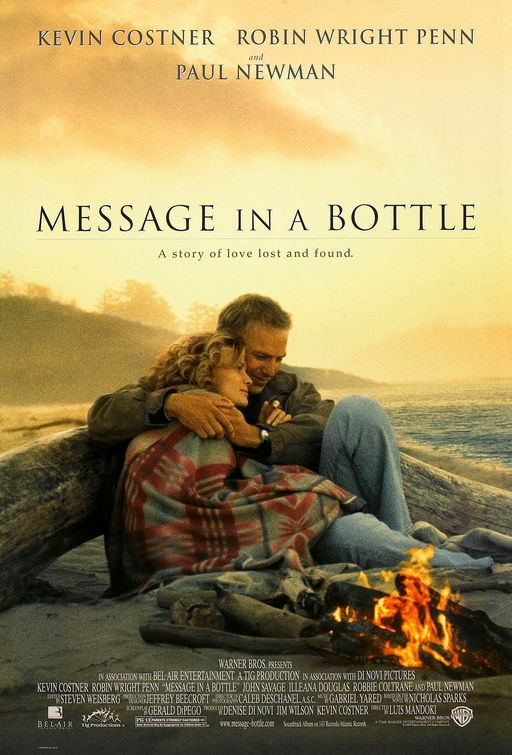

## Message in a Bottle

Director: Luis Mandoki

Screenplay: Gerald Dipego

Cast: Kevin Costner, Robin Wright Penn, John Savage, Illeana Douglas, Robbie Coltrane

In the poignant film "Message in a Bottle," grieving widower Garret Blake finds solace in building boats while struggling to rebuild his life. When Theresa Osborne, a lonely divorcee and researcher, discovers a message inside a bottle on a Cape Cod beach, she is deeply moved by its contents and becomes determined to find its author. As Theresa and Garret's paths cross, their connection deepens, leading to a journey of love lost and found. With Kevin Costner portraying Garret and Robin Wright Penn as Theresa, the film captures the emotional depth of Nicholas Sparks' bestselling novel. Directed by Luis Mandoki, "Message in a Bottle" showcases high-voltage star power and delivers a tender and moving tale that explores the enduring power of love.