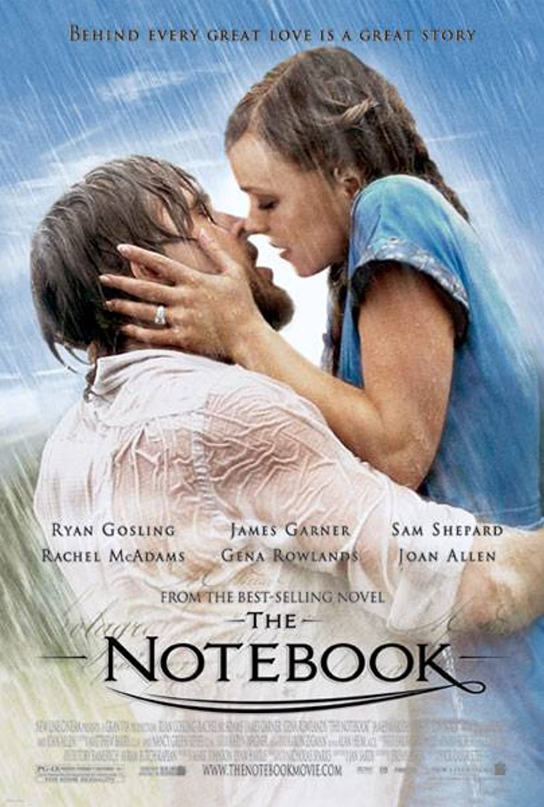

## The Notebook

Director: Nick Cassavetes

Screenplay: Jeremy Leven

Cast: Gena Rowlands, James Garner, Ryan Gosling

"The Notebook" tells the touching story of Allie and Noah, whose passionate teenage romance is cut short by societal expectations and family disapproval. Despite being separated for years, their love is rekindled when they reunite later in life, forcing Allie to choose between her heart's desire and the expectations placed upon her by society.

Portrayed by Rachel McAdams and Ryan Gosling, Allie and Noah's love story is timeless and heartwarming, capturing the hearts of audiences around the world. The film is based on the best-selling novel by Nicholas Sparks and is known for its emotional depth and sweeping romantic narrative.

As an older gentleman (James Garner) reads the story of Allie and Noah to his companion (Gena Rowlands), the film explores themes of enduring love, sacrifice, and the power of memories. "The Notebook" is a poignant and unforgettable tale that resonates with audiences of all ages.